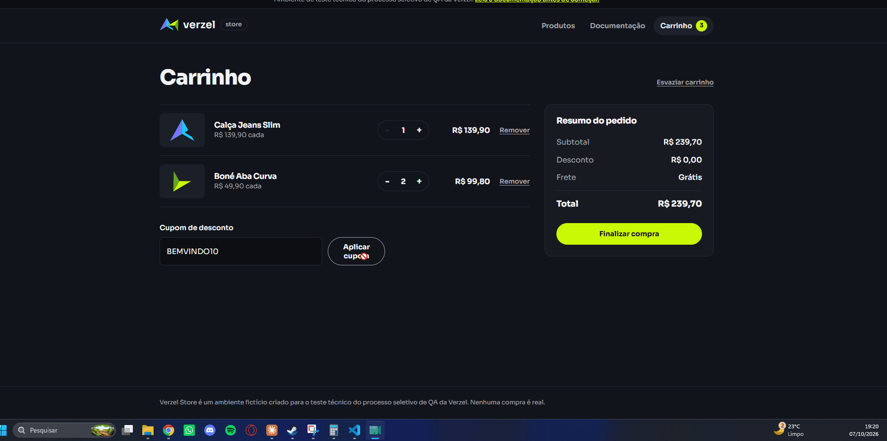
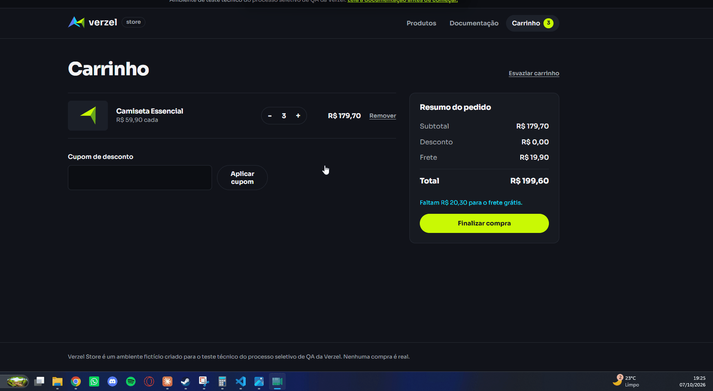

# Execução

Status: **Passou** (resultado igual ao esperado) · **Falhou** (o sistema respondeu diferente do esperado; vira bug) · **Bloqueado** (não foi possível executar). "—" = não executado; nas colunas Firefox e WebKit das linhas de API, "—" quer dizer "não se aplica" (a API roda só no Chromium).

Colunas Chromium, Firefox e WebKit: resultado em cada navegador, na execução de 07/10/2026 (`npm run test:all`). Os cenários de UI rodaram nos três navegadores. Os de API não dependem de navegador e rodam uma vez, pelo Chromium; por isso ficam com "—" no Firefox e no WebKit. Os caminhos de evidência são relativos a `docs/05-evidencias/`. Os relatórios completos dessa execução, um por navegador, estão em [05-evidencias/automacao/relatorios/](05-evidencias/automacao/relatorios/): `cucumber-report-chromium.html`, `cucumber-report-firefox.html` e `cucumber-report-webkit.html`. Eles são a evidência das linhas que passaram.

Nos `Scenario Outline`, cada exemplo tem a sua linha (ex.: `CT-24 · 199,90`), para cada resultado ter evidência própria.

## Cupom de desconto (`features/cupom.feature`)

| ID | Cenário | Regra | Camada | Tipo | Chromium | Firefox | WebKit | Evidência | Bug |
|---|---|---|---|---|---|---|---|---|---|
| CT-01 | Cupom válido mostra o desconto e esconde o campo de cupom | CA01, CA05 | UI | automatizado | Passou | Passou | Passou | | |
| CT-02 · XYZ123 | Cupom recusado mostra o motivo e não dá desconto | CA03 | UI | automatizado | Passou | Passou | Passou | | |
| CT-02 · VERAO2026 | Cupom recusado mostra o motivo e não dá desconto | CA04 | UI | automatizado | Passou | Passou | Passou | | |
| CT-03 | Para trocar de cupom, o cliente remove o atual e aplica outro | CA05 | UI | automatizado | Passou | Passou | Passou | | |
| CT-04 · BEMVINDO10 | API aplica 10% de desconto com o BEMVINDO10 em qualquer forma aceita | CA01 | API | automatizado | Passou | — | — | | |
| CT-04 · bemvindo10 | API aplica 10% de desconto com o BEMVINDO10 em qualquer forma aceita | CA02 | API | automatizado | Passou | — | — | | |
| CT-04 · `" bemVindo10 "` | API aplica 10% de desconto com o BEMVINDO10 em qualquer forma aceita | CA02 | API | automatizado | Passou | — | — | | |
| CT-05 · XYZ123 | API recusa cupom inexistente ou expirado sem erro e sem desconto | CA03 | API | automatizado | Passou | — | — | | |
| CT-05 · VERAO2026 | API recusa cupom inexistente ou expirado sem erro e sem desconto | CA04 | API | automatizado | Passou | — | — | | |
| CT-05 · verao2026 | API recusa cupom inexistente ou expirado sem erro e sem desconto | CA02, CA04 | API | automatizado | Passou | — | — | | |
| CT-06 · XYZ123 | Pedido com cupom inexistente ou expirado é recusado com 422 | CA03 | API | automatizado | Passou | — | — | | |
| CT-06 · VERAO2026 | Pedido com cupom inexistente ou expirado é recusado com 422 | CA04 | API | automatizado | Passou | — | — | | |

## Frete grátis (`features/frete.feature`)

| ID | Cenário | Regra | Camada | Tipo | Chromium | Firefox | WebKit | Evidência | Bug |
|---|---|---|---|---|---|---|---|---|---|
| CT-20 | Frete grátis com subtotal de exatamente R$ 200,00 | CA06 | UI | automatizado | Falhou | Falhou | Falhou | `automacao/CT-20_chromium_falhou.png`, `automacao/CT-20_firefox_falhou.png`, `automacao/CT-20_webkit_falhou.png` | BUG-01 |
| CT-21 | Frete cobrado e aviso de R$ 0,10 com subtotal de R$ 199,90 | CA07 | UI | automatizado | Passou | Passou | Passou | | |
| CT-22 | Frete passa a ser grátis ao aumentar a quantidade no carrinho | CA06 | UI | automatizado | Passou | Passou | Passou | | |
| CT-23 | API dá frete grátis com subtotal de exatamente R$ 200,00 | CA06 | API | automatizado | Falhou | — | — | `automacao/CT-23_api.json` | BUG-01 |
| CT-24 · 219,80 | API calcula frete e valor faltante acima e abaixo de R$ 200,00 | CA06 | API | automatizado | Passou | — | — | | |
| CT-24 · 239,70 | API calcula frete e valor faltante acima e abaixo de R$ 200,00 | CA06 | API | automatizado | Passou | — | — | | |
| CT-24 · 199,90 | API calcula frete e valor faltante acima e abaixo de R$ 200,00 | CA07 | API | automatizado | Passou | — | — | | |
| CT-24 · 199,80 | API calcula frete e valor faltante acima e abaixo de R$ 200,00 | CA07 | API | automatizado | Passou | — | — | | |
| CT-24 · 79,80 | API calcula frete e valor faltante acima e abaixo de R$ 200,00 | CA07 | API | automatizado | Passou | — | — | | |
| CT-25 | API mantém frete grátis quando o cupom deixa o valor em R$ 180,00 | CA08 | API | automatizado | Falhou | — | — | `automacao/CT-25_api.json` | BUG-01 |
| CT-26 · 219,80 | API calcula desconto e frete com cupom | CA08 | API | automatizado | Passou | — | — | | |
| CT-26 · 109,80 | API calcula desconto e frete com cupom | CA09 | API | automatizado | Passou | — | — | | |
| CT-27 | Pedido com subtotal de exatamente R$ 200,00 sai com frete grátis | CA06 | API | automatizado | Falhou | — | — | `automacao/CT-27_api.json` | BUG-01 |

## Limite de quantidade (`features/quantidade.feature`)

| ID | Cenário | Regra | Camada | Tipo | Chromium | Firefox | WebKit | Evidência | Bug |
|---|---|---|---|---|---|---|---|---|---|
| CT-50 | Carrinho trava o botão + ao chegar a 5 unidades | CA10 | UI | automatizado | Passou | Passou | Passou | | |
| CT-51 | Vitrine trava o botão Adicionar ao carrinho ao chegar a 5 unidades | CA10 | UI | automatizado | Passou | Passou | Passou | | |
| CT-52 · 5 | API aceita até 5 unidades e recusa quantidade acima do limite ou inválida | CA10 | API | automatizado | Passou | — | — | | |
| CT-52 · 6 | API aceita até 5 unidades e recusa quantidade acima do limite ou inválida | CA10 | API | automatizado | Falhou | — | — | `automacao/CT-52-ex2_api.json` | BUG-03 |
| CT-52 · 0 | API aceita até 5 unidades e recusa quantidade acima do limite ou inválida | CA10 | API | automatizado | Passou | — | — | | |
| CT-52 · -1 | API aceita até 5 unidades e recusa quantidade acima do limite ou inválida | CA10 | API | automatizado | Passou | — | — | | |
| CT-52 · 1.5 | API aceita até 5 unidades e recusa quantidade acima do limite ou inválida | CA10 | API | automatizado | Passou | — | — | | |
| CT-52 · `"2"` | API aceita até 5 unidades e recusa quantidade acima do limite ou inválida | CA10 | API | automatizado | Passou | — | — | | |
| CT-53 | Pedido com mais de 5 unidades de um produto é recusado | CA10 | API | automatizado | Falhou | — | — | `automacao/CT-53_api.json` | BUG-03 |

## Checkout e confirmação (`features/checkout.feature`)

| ID | Cenário | Regra | Camada | Tipo | Chromium | Firefox | WebKit | Evidência | Bug |
|---|---|---|---|---|---|---|---|---|---|
| CT-60 | Compra completa com cupom, do carrinho à confirmação | CA01, regra da loja | UI | automatizado | Passou | Passou | Passou | | |
| CT-61 · nome | Dado do cliente inválido mostra a mensagem do campo e não confirma o pedido | regra da loja | UI | automatizado | Passou | Passou | Passou | | |
| CT-61 · email | Dado do cliente inválido mostra a mensagem do campo e não confirma o pedido | regra da loja | UI | automatizado | Passou | Passou | Passou | | |
| CT-61 · cep 7 dígitos | Dado do cliente inválido mostra a mensagem do campo e não confirma o pedido | regra da loja | UI | automatizado | Passou | Passou | Passou | | |
| CT-61 · cep 9 dígitos | Dado do cliente inválido mostra a mensagem do campo e não confirma o pedido | regra da loja | UI | automatizado | Passou | Passou | Passou | | |
| CT-62 · 01310-100 | API cria o pedido com número VZ- e CEP normalizado | regra da loja | API | automatizado | Passou | — | — | | |
| CT-62 · 01310100 | API cria o pedido com número VZ- e CEP normalizado | regra da loja | API | automatizado | Passou | — | — | | |
| CT-63 | API recusa pedido com dados do cliente inválidos | regra da loja | API | automatizado | Passou | — | — | | |

## Contrato da API (`features/api-erros.feature`)

| ID | Cenário | Regra | Camada | Tipo | Chromium | Firefox | WebKit | Evidência | Bug |
|---|---|---|---|---|---|---|---|---|---|
| CT-80 · JSON_INVALIDO | API responde com o status e o código de erro documentados | contrato da API | API | automatizado | Passou | — | — | | |
| CT-80 · ROTA_NAO_ENCONTRADA | API responde com o status e o código de erro documentados | contrato da API | API | automatizado | Passou | — | — | | |
| CT-80 · PRODUTO_NAO_ENCONTRADO 404 | API responde com o status e o código de erro documentados | contrato da API | API | automatizado | Passou | — | — | | |
| CT-80 · PRODUTO_NAO_ENCONTRADO 422 | API responde com o status e o código de erro documentados | contrato da API | API | automatizado | Passou | — | — | | |
| CT-80 · ITENS_OBRIGATORIOS sem itens | API responde com o status e o código de erro documentados | contrato da API | API | automatizado | Passou | — | — | | |
| CT-80 · ITENS_OBRIGATORIOS lista vazia | API responde com o status e o código de erro documentados | contrato da API | API | automatizado | Passou | — | — | | |
| CT-80 · ITEM_INVALIDO | API responde com o status e o código de erro documentados | contrato da API | API | automatizado | Passou | — | — | | |
| CT-80 · ITEM_DUPLICADO | API responde com o status e o código de erro documentados | contrato da API | API | automatizado | Passou | — | — | | |
| CT-81 · GET /api/carrinho/calcular | API recusa método não aceito numa rota existente | contrato da API | API | automatizado | Passou | — | — | | |
| CT-81 · GET /api/pedidos | API recusa método não aceito numa rota existente | contrato da API | API | automatizado | Passou | — | — | | |
| CT-81 · POST /api/produtos | API recusa método não aceito numa rota existente | contrato da API | API | automatizado | Passou | — | — | | |
| CT-82 | API lista os 8 produtos e consulta um produto pelo id | contrato da API | API | automatizado | Passou | — | — | | |
| CT-83 · 239,70 | API calcula o total pela fórmula, com itens e valores em 2 casas decimais | CA11, fórmula | API | automatizado | Passou | — | — | | |
| CT-83 · 109,80 | API calcula o total pela fórmula, com itens e valores em 2 casas decimais | CA11, fórmula | API | automatizado | Passou | — | — | | |

---

## Execução manual — Google Chrome 154

A exploração manual de 06/10/2026, feita no Google Chrome 154.0.8037.98 e registrada em [00-exploracao.md](00-exploracao.md), já cobre a maior parte dos cenários de UI. Para não repetir o trabalho, cada exemplo aponta para o item da exploração que o cobre e usa o resultado registrado ali. Os dois que nenhum item cobria (CT-03 e CT-22) foram executados à mão em 07/10/2026, no Google Chrome, e gravados em GIF; os passos e as gravações estão logo abaixo da tabela.

| ID | Cenário | Item da exploração | Resultado | Evidência |
|---|---|---|---|---|
| CT-01 | Cupom válido mostra o desconto e esconde o campo de cupom | 3-01, 3-09 | Passou: com P002 + P004 ×2 e BEMVINDO10, total R$ 215,73; o campo some e aparece "Cupom BEMVINDO10 aplicado." com "Remover cupom" | só registro em texto |
| CT-02 · XYZ123 | Cupom recusado mostra o motivo e não dá desconto | 3-05, 3-11 | Passou: "Cupom inválido.", sem desconto (o desconto só entrou ao aplicar o BEMVINDO10 em seguida). Carrinho de R$ 239,70, não o P005 do cenário; a regra não depende do carrinho | só registro em texto |
| CT-02 · VERAO2026 | Cupom recusado mostra o motivo e não dá desconto | 3-06, seção 7 | Passou: "Cupom expirado." e, com P005, total R$ 119,90 sem desconto | só registro em texto |
| CT-03 | Para trocar de cupom, o cliente remove o atual e aplica outro | 3-09 e 3-10 cobrem só parte (cupom único e remoção); o resto foi executado à mão | Passou (execução manual, 07/10/2026): depois de remover o BEMVINDO10, o campo voltou; o VERAO2026 mostrou "Cupom expirado.", com subtotal e total de R$ 239,70 | [`manual/CT-03_chrome.gif`](05-evidencias/manual/CT-03_chrome.gif) |
| CT-20 | Frete grátis com subtotal de exatamente R$ 200,00 | 4-01 | **Falhou (BUG-01)**: frete R$ 19,90, total R$ 219,90 e "Faltam R$ 0,00 para o frete grátis." | `exploracao/EXP-4-01_frete-200-payload.png`, `exploracao/EXP-4-01_frete-200-response.png` |
| CT-21 | Frete cobrado e aviso de R$ 0,10 com subtotal de R$ 199,90 | 4-02 | Passou: frete R$ 19,90 e faltam R$ 0,10 | só registro em texto |
| CT-22 | Frete passa a ser grátis ao aumentar a quantidade no carrinho | nenhum (a exploração não cruzou o limite pelo botão +); executado à mão | Passou (execução manual, 07/10/2026): com 3 camisetas, R$ 179,70 e "Faltam R$ 20,30"; depois do "+", quantidade 4, R$ 239,60, frete "Grátis" e sem o aviso | [`manual/CT-22_chrome.gif`](05-evidencias/manual/CT-22_chrome.gif) |
| CT-50 | Carrinho trava o botão + ao chegar a 5 unidades | seção 2, "Limite de 5 unidades (CA10)" | Passou: com 5 unidades, o + fica desabilitado e aparece "Limite de 5 unidades por produto." | só registro em texto |
| CT-51 | Vitrine trava o botão Adicionar ao carrinho ao chegar a 5 unidades | seção 1 (5º item) | Passou: o botão do produto fica desabilitado e o card mostra "Limite de 5 unidades atingido." | só registro em texto |
| CT-60 | Compra completa com cupom, do carrinho à confirmação | seção 6 | Passou: P005 + BEMVINDO10 + Maria Silva → "Pedido confirmado", VZ-856317; subtotal 100,00, desconto 10,00, frete 19,90, total 109,90; "o pagamento será feito na entrega"; carrinho esvaziado | só registro em texto |
| CT-61 · nome | Dado do cliente inválido mostra a mensagem do campo e não confirma o pedido | 5-01 | Passou: "Informe nome e sobrenome." | só registro em texto |
| CT-61 · email | Dado do cliente inválido mostra a mensagem do campo e não confirma o pedido | 5-06 | Passou: "Informe um e-mail válido." | só registro em texto |
| CT-61 · cep 7 dígitos | Dado do cliente inválido mostra a mensagem do campo e não confirma o pedido | 5-10 | Passou: "Informe um CEP com 8 dígitos." | só registro em texto |
| CT-61 · cep 9 dígitos | Dado do cliente inválido mostra a mensagem do campo e não confirma o pedido | 5-11 | Passou: "Informe um CEP com 8 dígitos." | só registro em texto |

### Cenários executados à mão (sem cobertura na exploração)

Abra uma **nova janela anônima** (Ctrl+Shift+N) em https://verzel-store.qa-test-verzel-store.workers.dev/ para cada cenário: o carrinho fica guardado só na aba, então ele começa vazio. "Adicionar" = clicar em "Adicionar ao carrinho" no card do produto; cada clique soma 1 unidade. As gravações estão em `docs/05-evidencias/manual/`.

**CT-03 — Para trocar de cupom, o cliente remove o atual e aplica outro**
1. Adicionar 1 Calça Jeans Slim e 2 Boné Aba Curva (2 cliques).
2. Abrir o Carrinho no cabeçalho, digitar `BEMVINDO10` no campo de cupom e clicar em "Aplicar cupom".
3. Clicar em "Remover cupom".
4. Digitar `VERAO2026` no campo de cupom e clicar em "Aplicar cupom".

Esperado: depois do passo 3, o campo de cupom volta. No passo 4 aparece "Cupom expirado.", e o resumo mostra subtotal R$ 239,70 e total R$ 239,70, sem desconto.

Resultado: **Passou**.

**CT-22 — Frete passa a ser grátis ao aumentar a quantidade no carrinho**
1. Adicionar 3 Camiseta Essencial (3 cliques).
2. Abrir o Carrinho no cabeçalho. Conferir: subtotal R$ 179,70, frete R$ 19,90 e o aviso "Faltam R$ 20,30 para o frete grátis.".
3. Clicar uma vez no "+" da Camiseta Essencial.

Esperado: quantidade 4, subtotal R$ 239,60, frete "Grátis", total R$ 239,60, e o aviso "Faltam R$ ..." some.

Resultado: **Passou**.

